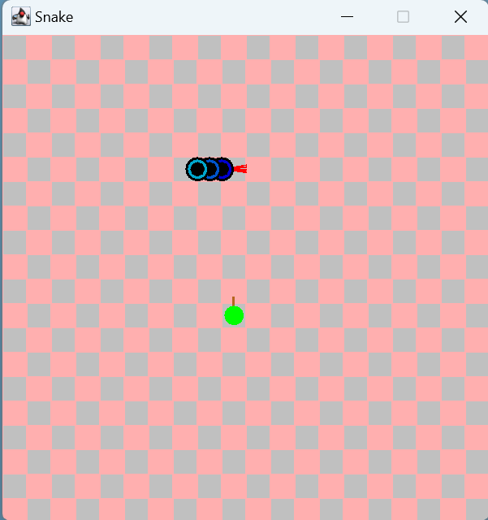
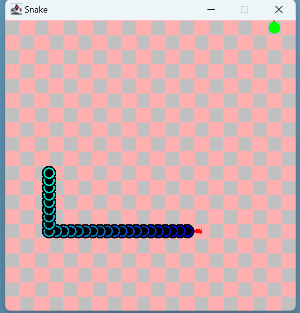

# Snake Game

## Overview

Welcome to my Snake Game! In this game, you'll control a snake that slithers around a board. Your goal is to eat the fruits that appear on the board. But be careful! If you touch the walls or the snake runs into itself, the game will end. Each time you eat a fruit, your snake will grow longer, making the game more challenging and exciting!

## How to Play

1. Use the arrow keys on your keyboard to control the snake's movement.
2. The snake must eat the fruits that randomly appear on the board.
3. Avoid crashing into the walls or the snake's own body.
4. Every time the snake eats a fruit, it gets longer, increasing the difficulty.
5. The game ends when the snake hits a wall or collides with itself.

## Game Features

- **Snake Movement:** Control the snake using the arrow keys.
- **Fruit Eating:** Collect fruits to grow the snake and score points.
- **Increasing Difficulty:** The snake grows longer with each fruit, making the game progressively harder.
- **Game Over:** The game ends if the snake hits a wall or collides with its own body.

## Installation and Running

1. Clone or download the repository.
2. Run the game by executing the Java script `Game`  in the `Snake/src` folder.
